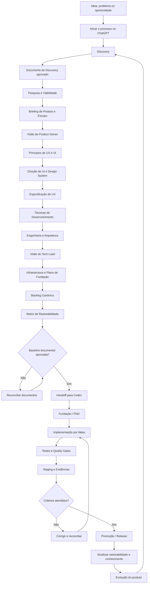

# Processo de Desenvolvimento de Software com IA Assistida

> **Status:** reconstrução controlada da metodologia  
> **Fonte canônica do processo:** este repositório  
> **Formato dos artefatos canônicos:** Markdown (`.md`) versionado  
> **Modelo operacional:** humano no controle + ChatGPT para descoberta e documentação + Codex para execução de engenharia

## 1. O que é este processo

O **Processo de Desenvolvimento de Software com IA Assistida** é uma metodologia para transformar uma ideia ainda informal em software implementado de forma progressiva, rastreável e verificável.

Ele não trata a IA como uma máquina que recebe um único prompt e devolve um sistema pronto. A IA participa de um processo de engenharia no qual decisões são descobertas, discutidas, pesquisadas, documentadas, aprovadas e somente depois executadas.

A metodologia separa deliberadamente três atividades que frequentemente são misturadas em projetos assistidos por IA:

```text
PENSAR O PRODUTO
        ↓
FORMALIZAR AS DECISÕES
        ↓
EXECUTAR O SOFTWARE
```

O ChatGPT atua principalmente nas duas primeiras. O Codex entra quando existe documentação suficiente para programar sem reconstruir a intenção do produto por conta própria.

A documentação não é um subproduto do desenvolvimento. Ela é a ponte operacional entre a intenção humana e a execução realizada pela IA.

---

## 2. Problema que o processo resolve

Um dos principais riscos do desenvolvimento assistido por IA é permitir que a implementação avance mais rápido do que a compreensão do produto.

Quando isso acontece, a IA tende a preencher lacunas sozinha, escolher tecnologias prematuramente, criar estruturas desnecessárias, alterar decisões implícitas e produzir código que funciona isoladamente, mas não representa de forma confiável o produto que o usuário imaginou.

Este processo existe para reduzir esse risco por meio de uma cadeia explícita:

```text
ideia
→ conversa
→ decisão
→ documento
→ aprovação
→ engenharia
→ backlog
→ implementação
→ teste
→ evidência
```

A regra central é:

> **A IA pode investigar, propor, comparar e executar. A autoridade para transformar uma hipótese em decisão canônica continua sendo humana.**

---

## 3. O que este processo não é

Este repositório não é:

- uma coleção de prompts para gerar aplicativos em uma única interação;
- um framework de programação;
- uma stack tecnológica fixa;
- um gerador automático de arquitetura;
- uma autorização para a IA tomar decisões de produto silenciosamente;
- uma substituição de revisão humana;
- uma promessa de que toda decisão produzida por IA estará correta;
- um processo que obriga todo projeto a usar as mesmas bibliotecas, provedores ou padrões arquiteturais.

A metodologia define **como chegar às decisões** e **como transmiti-las entre humano, ChatGPT, documentação, Git e Codex**.

---

## 4. Princípios fundamentais

### 4.1. Conversa não é documentação canônica

Ideias discutidas no chat são matéria-prima. Elas podem conter hipóteses, contradições, alternativas e decisões ainda incompletas.

Uma conversa somente se transforma em fonte da verdade depois de passar pelo processo de revisão e canonização previsto para cada etapa.

### 4.2. Um documento por vez

A documentação deve ser construída progressivamente.

A IA apresenta o conteúdo, o humano lê, corrige e aprova, e somente então o artefato correspondente é canonizado.

Não é objetivo deste processo gerar toda a documentação do projeto de uma única vez.

### 4.3. A etapa seguinte consome a anterior

Cada camada deve receber decisões suficientemente maduras da camada anterior.

Isso reduz a necessidade de a IA reinterpretar todo o projeto sempre que uma nova etapa começa.

### 4.4. Documentação aprovada governa execução

Quando existir conflito entre uma interpretação informal da IA e uma decisão já canonizada, a IA não deve alterar silenciosamente a intenção do projeto.

O conflito deve ser apresentado e reconciliado.

### 4.5. Implementação não redefine produto por acidente

Código existente é evidência do estado de execução, mas não ganha automaticamente precedência sobre decisões de produto, experiência, arquitetura ou stack.

Se o runtime divergir da documentação, existe uma inconsistência a ser investigada.

### 4.6. IA também está sujeita a engenharia

Ser gerado por IA não reduz o padrão de qualidade exigido do software.

Código, testes, arquitetura, segurança, documentação e infraestrutura devem possuir critérios explícitos e verificáveis.

---

## 5. Onde utilizar

O processo é recomendado principalmente para projetos em que a intenção precisa sobreviver a muitas interações, documentos e ciclos de implementação, por exemplo:

- aplicações web;
- aplicativos móveis;
- produtos SaaS;
- plataformas internas com regras de negócio relevantes;
- sistemas com múltiplos perfis de usuário;
- produtos que envolvem integrações externas;
- projetos com requisitos de segurança, privacidade ou auditoria;
- produtos que serão implementados total ou parcialmente por agentes de IA;
- projetos que precisam continuar compreensíveis depois que a conversa original terminar.

Ele também pode ser utilizado para evoluções relevantes de produtos existentes, desde que a documentação seja reconciliada com o estado real do software.

### Quando provavelmente é excesso de processo

Para scripts descartáveis, provas de conceito extremamente pequenas ou tarefas isoladas sem continuidade, aplicar todas as etapas pode gerar mais custo documental do que valor.

A metodologia deve ser proporcional ao risco, duração e complexidade do produto.

---

## 6. Ambiente atualmente homologado pelo processo

Neste repositório, **homologado** significa que esse é o fluxo operacional usado ou validado pela metodologia. Não significa certificação oficial dos fabricantes das ferramentas.

| Ambiente | Papel no processo | Situação |
| --- | --- | --- |
| ChatGPT | Discovery, investigação, pesquisa, entrevistas, elaboração e revisão documental | Homologado para a fase documental |
| GitHub | Fonte versionada da metodologia e dos documentos do projeto | Homologado para versionamento e handoff |
| Codex | Leitura da baseline documental, Fundação, implementação, testes e execução do backlog | Homologado para execução de engenharia |
| Pesquisa web | Validação de mercado, documentação oficial, versões, preços, limites, segurança e informações temporais | Obrigatória quando a decisão depender de informação atual |
| Ambiente local do projeto | Execução do código, toolchain, testes e integração com o repositório | Esperado para a fase Codex |

O processo não deve depender de um nome específico de modelo. Quando houver escolha, recomenda-se utilizar modelos com capacidade suficiente de raciocínio, leitura longa, uso de ferramentas e análise de código para a etapa executada.

Outros agentes, IDEs ou provedores podem ser compatíveis, mas devem ser tratados como **não homologados até que o fluxo completo seja validado**.

---

## 7. Como acionar o processo

O processo pode ser iniciado diretamente em uma conversa do ChatGPT.

O comando mínimo é:

```text
Vamos utilizar o Processo de Desenvolvimento de Software com IA Assistida:
https://github.com/jukazilli/processo-de-desenvolvimento-de-software-com-ia-assistida

Quero começar o Discovery.
A ideia é: <descreva sua ideia inicial>.
```

Exemplo:

```text
Vamos utilizar o Processo de Desenvolvimento de Software com IA Assistida:
https://github.com/jukazilli/processo-de-desenvolvimento-de-software-com-ia-assistida

Quero começar o Discovery.
A ideia é criar uma plataforma em que pessoas possam registrar golpes que descobriram,
discutir como eles funcionam e acompanhar novos tipos de golpe publicados pela comunidade.
```

Esse comando possui duas funções:

1. **ativa a metodologia como protocolo da conversa**;
2. **define que a primeira etapa operacional será o Discovery**.

A descrição inicial não precisa estar completa. O objetivo do Discovery será justamente desenvolver essa ideia junto ao usuário antes que ela se transforme em requisito formal.

---

## 8. Bootstrap recomendado para o ChatGPT

Ao receber o comando de ativação, o ChatGPT deve, antes de conduzir a metodologia:

1. acessar a fonte canônica indicada pelo usuário;
2. ler integralmente a versão atual do processo;
3. identificar, quando possível, repositório, branch e commit carregados;
4. entender a responsabilidade e a ordem das etapas disponíveis;
5. tratar a conversa já existente como contexto, quando ela fizer parte da ideia que será desenvolvida;
6. não pular diretamente para arquitetura, stack ou código;
7. não gerar toda a documentação automaticamente;
8. iniciar somente a etapa solicitada pelo usuário;
9. manter aprovação humana antes de canonizar decisões;
10. reler documentos canônicos quando a continuidade da conversa não for suficiente para garantir contexto confiável.

A sessão deve permanecer vinculada à versão carregada do processo durante aquele ciclo de trabalho. Atualizações posteriores da `main` não devem mudar silenciosamente as regras de uma conversa já em andamento.

---

## 9. Como utilizar a metodologia

O processo deve ser entendido como uma sequência de **transformações de conhecimento**, e não apenas como uma sequência de arquivos.

Em cada etapa:

```text
entrada conhecida
        ↓
investigação / elaboração
        ↓
proposta apresentada no chat
        ↓
revisão humana
        ↓
correções
        ↓
aprovação
        ↓
documento canônico
        ↓
entrada da próxima etapa
```

A IA não deve confundir três estados diferentes:

```text
DISCUTIDO
≠
APROVADO
≠
CANONIZADO
```

Uma decisão pode ter sido discutida sem ter sido aprovada. E um conteúdo pode ter sido aprovado conceitualmente sem que o humano ainda tenha autorizado sua gravação no repositório ou pasta do projeto.

---

## 10. Responsabilidades

### Humano

O humano é responsável por:

- apresentar intenção, contexto e restrições;
- responder entrevistas e perguntas que dependam de decisão humana;
- corrigir interpretações erradas;
- escolher entre trade-offs relevantes;
- aprovar conteúdo;
- autorizar canonização;
- aprovar custos, riscos e ações sensíveis;
- decidir quando uma etapa pode avançar.

### ChatGPT

O ChatGPT é responsável por:

- conduzir o Discovery;
- transformar conversa em perguntas úteis;
- pesquisar quando necessário;
- distinguir evidência, hipótese, decisão e pendência;
- elaborar documentos progressivamente;
- verificar consistência entre camadas;
- explicar conflitos antes de resolvê-los;
- manter a documentação compreensível e consumível pelas etapas seguintes.

### Codex

O Codex é responsável por:

- consumir a documentação já aprovada;
- verificar o estado real do repositório;
- executar Fundação e backlog elegível;
- respeitar técnicas, arquitetura, stack e infraestrutura aprovadas;
- escrever código, testes e automações;
- produzir evidências de implementação;
- atualizar rastreabilidade conforme a execução;
- interromper a execução quando uma lacuna exigir nova decisão humana.

### GitHub

O GitHub funciona como memória versionada do processo e, quando adotado pelo projeto, como fonte de verdade dos documentos e do software.

---

## 11. Recomendações de uso

1. **Comece pela conversa, não pela stack.** Uma ideia ainda pouco compreendida não precisa de framework.
2. **Mantenha o Discovery e a documentação no ChatGPT enquanto houver decisões de produto sendo formadas.**
3. **Use Git cedo para versionar decisões aprovadas**, mas não transforme cada resposta do chat em arquivo.
4. **Prefira Markdown como fonte canônica.** Outros formatos podem ser derivados para apresentação, mas não devem criar fontes concorrentes.
5. **Use pesquisa atual quando a decisão envelhece.** Mercado, preços, versões, políticas, APIs, limites, segurança e regulamentação não devem ser respondidos apenas por memória do modelo.
6. **Não compartilhe secrets no chat.** Senhas, tokens, chaves privadas e credenciais privilegiadas devem permanecer em meios apropriados.
7. **Não entregue o projeto ao Codex cedo demais.** O Codex deve receber contexto suficiente para executar, não para adivinhar o produto.
8. **Não confunda velocidade com progresso.** Gerar muitos arquivos ou muito código rapidamente pode apenas multiplicar decisões não validadas.
9. **Quando houver conflito, reconcilie a camada responsável.** Não corrija uma contradição espalhando a mesma contradição para documentos seguintes.
10. **Faça mudanças incrementais na metodologia.** Um refinamento posterior deve preservar decisões válidas anteriores ou explicar explicitamente por que elas foram substituídas.

---

## 12. Como o processo foi testado

A metodologia foi extraída e posteriormente formalizada a partir do desenvolvimento real do **DayGym**.

No material original do projeto, a Pesquisa e Viabilidade aparece explicitamente como uma **investigação pré-briefing** e como a primeira etapa de um processo maior. O próprio documento encerra a investigação separando evidência, materiais analisados e hipóteses antes de declarar que o Briefing será o próximo artefato.

A experiência do DayGym também estabeleceu uma progressão documental que passa por produto, Product Owner, UI, UX, técnicas de desenvolvimento e arquitetura antes da criação do repositório e da implementação.

Esse histórico é usado como evidência prática para reconstruir esta metodologia, mas os documentos específicos do DayGym não são copiados cegamente. O objetivo deste repositório é extrair deles um processo reutilizável para outros produtos.

### O que significa "testado" aqui

Significa que as etapas e separações documentais surgiram de um projeto real e foram utilizadas para conduzir decisões e implementação.

Não significa que o processo esteja encerrado ou que não possa ser refinado. Esta metodologia é versionada justamente porque novas aplicações podem revelar lacunas, redundâncias ou oportunidades de simplificação.

---

## 13. Fluxo macro do processo



O diagrama representa o fluxo macro. Cada etapa será documentada neste README com responsabilidade, entrada, comportamento esperado, gates humanos e saída canônica.

---

## 14. Handoff entre ChatGPT e Codex

O ponto de transição não é determinado por quantidade de conversa nem por entusiasmo com a ideia.

O handoff ocorre quando existe uma **baseline documental suficiente e aprovada** para que o Codex possa executar sem reconstruir decisões fundamentais por conta própria.

Em termos simples:

```text
CHATGPT
ideia → Discovery → pesquisa → decisões → documentos aprovados

                    ↓ Git / arquivos canônicos

CODEX
leitura → Fundação → backlog → código → testes → evidência
```

O ChatGPT continua podendo ser utilizado depois do handoff para decisões que retornem à camada de produto ou documentação. O Codex não recebe autoridade para preencher silenciosamente essas lacunas.

---

## 15. Versionamento do processo

A metodologia deve ser tratada como software: possui histórico, versões e mudanças rastreáveis.

Uma sessão que ativa o processo deve, sempre que possível, registrar qual versão foi consumida:

```text
PROCESS_SOURCE: jukazilli/processo-de-desenvolvimento-de-software-com-ia-assistida
BRANCH: <branch>
COMMIT: <sha>
```

Uma atualização da metodologia não deve modificar silenciosamente uma sessão que já está em andamento.

Quando o usuário decidir atualizar a Engine, a IA deve reler a nova versão e reconciliar mudanças materiais antes de continuar.

---

## 16. Estado desta reconstrução

Esta branch reconstrói a documentação da metodologia progressivamente, utilizando como referência a experiência real do DayGym e as evoluções posteriores já aprendidas.

A primeira camada deste README estabelece apenas:

- propósito;
- escopo;
- responsabilidades;
- forma de ativação;
- ambientes homologados;
- recomendações de uso;
- fluxo macro;
- regras gerais de operação.

As etapas específicas serão adicionadas e revisadas **uma por vez**.

### Próximo incremento

O próximo incremento deste documento formalizará o **Discovery**, incluindo:

- o que é;
- como é acionado;
- como o usuário deve interagir com o ChatGPT;
- o que o ChatGPT deve investigar;
- o que não deve fazer ainda;
- como identificar que o Discovery está suficiente;
- como ocorre a revisão humana;
- qual documento deve ser gerado;
- qual informação esse documento deve entregar à Pesquisa e Viabilidade.

> **A metodologia começa antes do primeiro documento técnico: começa quando humano e IA transformam uma ideia vaga em contexto compreensível sem antecipar a solução.**
