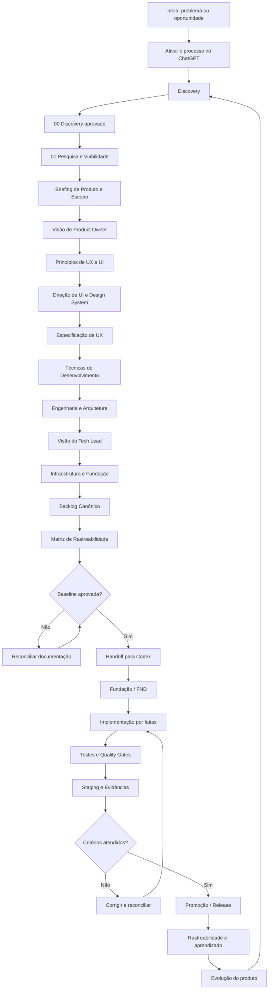

# Processo de Desenvolvimento de Software com IA Assistida

> **Status:** reconstrução controlada da metodologia  
> **Fonte canônica:** este repositório  
> **Formato canônico dos documentos de projeto:** Markdown (`.md`) versionado  
> **Modelo operacional:** humano no controle + ChatGPT para descoberta e documentação + Codex para execução de engenharia

## O que é

O **Processo de Desenvolvimento de Software com IA Assistida** é uma metodologia para transformar uma ideia ainda informal em software implementado de forma progressiva, rastreável e verificável.

Ele não trata a IA como uma máquina que recebe um único prompt e devolve um sistema pronto. A IA participa de um processo no qual ideias são exploradas, decisões são amadurecidas, evidências são pesquisadas, documentos são revisados por humanos e somente depois a execução é entregue ao ambiente de engenharia.

A documentação é a ponte entre a intenção humana e a execução realizada pela IA.

```text
PENSAR O PRODUTO
        ↓
FORMALIZAR AS DECISÕES
        ↓
EXECUTAR O SOFTWARE
```

O ChatGPT atua principalmente nas duas primeiras partes. O Codex entra quando existe documentação suficiente para programar sem reconstruir a intenção do produto por conta própria.

---

## Problema que o processo resolve

Um dos principais riscos do desenvolvimento assistido por IA é permitir que a implementação avance mais rápido do que a compreensão do produto.

Quando isso acontece, a IA pode preencher lacunas sozinha, escolher tecnologias cedo demais, criar estruturas desnecessárias e produzir código que funciona isoladamente, mas não representa com fidelidade o produto imaginado.

O processo reduz esse risco por meio de uma cadeia explícita:

```text
ideia
→ conversa
→ decisão
→ documento
→ aprovação
→ engenharia
→ backlog
→ implementação
→ teste
→ evidência
```

> **A IA pode investigar, propor, comparar e executar. A autoridade para transformar uma hipótese em decisão canônica continua sendo humana.**

---

## O que este processo não é

Este repositório não é:

- uma coleção de prompts para gerar aplicativos em uma única interação;
- um framework de programação;
- uma stack tecnológica fixa;
- um gerador automático de arquitetura;
- uma autorização para a IA tomar decisões de produto silenciosamente;
- uma substituição de revisão humana;
- uma promessa de que toda decisão produzida por IA estará correta;
- um processo que obriga todos os projetos a usar as mesmas bibliotecas, provedores ou padrões arquiteturais.

A metodologia define **como chegar às decisões e como transmiti-las entre humano, ChatGPT, documentação, Git e Codex**.

---

## Princípios fundamentais

**Conversa não é documentação canônica.** Ideias discutidas no chat são matéria-prima e podem conter hipóteses, contradições e alternativas.

**Um documento por vez.** A IA apresenta o conteúdo, o humano lê, corrige e aprova, e somente então o artefato correspondente é canonizado.

**A etapa seguinte consome a anterior.** Cada camada recebe contexto suficientemente amadurecido para reduzir reinvenção e perda de intenção.

**Documentação aprovada governa execução.** Código existente não ganha automaticamente precedência sobre uma decisão canônica só porque foi implementado primeiro.

**IA também está sujeita a engenharia.** Código, testes, arquitetura, segurança, documentação e infraestrutura precisam de critérios verificáveis.

O processo distingue explicitamente:

```text
DISCUTIDO
≠
APROVADO
≠
CANONIZADO
```

---

## Onde utilizar

O processo é indicado principalmente para:

- aplicações web e mobile;
- produtos SaaS;
- plataformas internas com regras de negócio relevantes;
- sistemas com múltiplos perfis de usuário;
- produtos com integrações externas;
- projetos com requisitos de segurança, privacidade ou auditoria;
- software implementado total ou parcialmente por agentes de IA;
- produtos que precisam continuar compreensíveis depois que a conversa original terminar;
- evoluções importantes de sistemas existentes, desde que a documentação seja reconciliada com o estado real.

Para scripts descartáveis, provas de conceito muito pequenas ou tarefas isoladas, aplicar todas as etapas pode ser excesso de processo. A profundidade deve ser proporcional ao risco e à continuidade do produto.

---

## Ambiente atualmente homologado

Neste repositório, **homologado** significa que o fluxo foi utilizado ou validado dentro desta metodologia. Não significa certificação oficial dos fabricantes das ferramentas.

| Ambiente | Papel | Situação |
| --- | --- | --- |
| ChatGPT | Discovery, investigação, pesquisa, elaboração e revisão documental | Homologado para a fase documental |
| GitHub | Versionamento da metodologia, documentos e handoff | Homologado |
| Codex | Fundação, implementação, testes e consumo do backlog | Homologado para execução de engenharia |
| Pesquisa web | Mercado, documentação oficial, versões, preços, políticas, riscos e fatos temporais | Obrigatória quando a decisão depender de informação atual |
| Ambiente local do projeto | Toolchain, testes, execução e integração com Git | Esperado na fase de engenharia |

O processo não depende de um nome específico de modelo. Recomenda-se utilizar modelos capazes de raciocínio, leitura longa, uso de ferramentas e análise de código compatíveis com a etapa executada.

Outros agentes, IDEs ou provedores podem ser compatíveis, mas devem ser tratados como **não homologados até que o fluxo completo seja validado**.

---

## Como acionar

O processo pode começar diretamente no ChatGPT.

Use:

```text
Vamos utilizar o Processo de Desenvolvimento de Software com IA Assistida:
https://github.com/jukazilli/processo-de-desenvolvimento-de-software-com-ia-assistida

Quero começar o Discovery.
A ideia é: <descreva sua ideia inicial>.
```

Exemplo:

```text
Vamos utilizar o Processo de Desenvolvimento de Software com IA Assistida:
https://github.com/jukazilli/processo-de-desenvolvimento-de-software-com-ia-assistida

Quero começar o Discovery.
A ideia é criar uma plataforma em que pessoas possam registrar golpes que descobriram,
discutir como eles funcionam e acompanhar novos golpes publicados pela comunidade.
```

A descrição inicial não precisa estar completa. O Discovery existe justamente para desenvolver a ideia antes que ela vire requisito formal.

Ao receber esse comando, o ChatGPT deve acessar a metodologia, ler a versão disponível, identificar quando possível branch/commit, localizar a etapa solicitada e iniciar somente o Discovery. Ele não deve pular diretamente para stack, arquitetura ou código.

---

## Como utilizar

Cada etapa segue a mesma disciplina geral:

```text
entrada conhecida
        ↓
investigação / elaboração
        ↓
proposta apresentada no chat
        ↓
revisão humana
        ↓
correções
        ↓
aprovação
        ↓
documento canônico
        ↓
entrada da próxima etapa
```

O humano é responsável por intenção, restrições, correções, trade-offs, aprovações e autorizações sensíveis.

O ChatGPT conduz descoberta, pesquisa e documentação, distingue hipótese de decisão e mantém consistência entre as camadas.

O Codex consome a baseline aprovada, prepara a Fundação, implementa backlog elegível, cria testes e evidências e interrompe a execução quando uma lacuna exige nova decisão humana.

---

## Recomendações

1. Comece pela conversa, não pela stack.
2. Mantenha no ChatGPT as etapas em que decisões de produto ainda estão sendo formadas.
3. Versione decisões aprovadas, não cada resposta da conversa.
4. Prefira Markdown como fonte canônica dos documentos.
5. Pesquise novamente fatos que envelhecem: mercado, versões, políticas, APIs, preços, segurança e regulamentação.
6. Não compartilhe senhas, tokens, chaves privadas ou credenciais privilegiadas no chat.
7. Não entregue o projeto ao Codex antes de existir contexto suficiente para execução.
8. Não confunda quantidade de arquivos ou código com avanço real.
9. Quando existir conflito, reconcilie a camada responsável em vez de espalhar a contradição.
10. Evolua a metodologia de forma versionada e rastreável.

---

## Como o processo foi testado

A metodologia foi extraída e formalizada a partir de um processo realmente utilizado no desenvolvimento do **DayGym** e vem sendo refinada com base nas lacunas encontradas durante sua reconstrução.

No material original do projeto, a Pesquisa e Viabilidade foi tratada como uma **investigação pré-Briefing**. O documento separou evidências públicas, materiais analisados e hipóteses e encerrou declarando que o Briefing seria o próximo artefato.

O mesmo material registra uma sequência de produto, Product Owner, UI, UX, desenvolvimento e arquitetura antes da criação do repositório e da implementação.

Nesta reconstrução, o Discovery está sendo formalizado como a etapa anterior que já ocorria por conversa, mas ainda não possuía um artefato próprio.

**Testado**, neste contexto, significa que a separação progressiva das decisões nasceu de uso real. Não significa que a metodologia esteja encerrada ou certificada externamente.

---

## Fluxo macro



O README apresenta apenas a visão geral. **As regras operacionais de cada etapa vivem em documentos próprios**, para que a explicação da metodologia não se misture com a metodologia executável.

---

## Comece pelo Discovery

A primeira etapa formal do processo é o Discovery.

Continue a leitura em:

### **[00 — Discovery](docs/processo/00_Discovery.md)**

Esse documento explica:

- como ativar a etapa;
- como humano e ChatGPT devem conduzir a conversa;
- o que precisa ser descoberto;
- o que ainda não deve ser decidido;
- como diferenciar decisão, hipótese, pendência e descarte;
- quando o Discovery está suficientemente maduro;
- como ocorre revisão e canonização;
- qual é a estrutura do `00_Discovery.md` gerado para cada projeto;
- como esse artefato alimenta a Pesquisa e Viabilidade.

> **A metodologia começa antes da primeira pesquisa: começa quando humano e IA conseguem descrever com clareza qual ideia será investigada sem antecipar a solução.**
