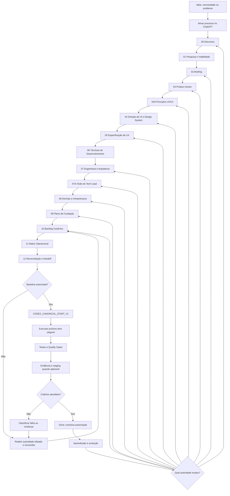

# Processo de Desenvolvimento de Software com IA Assistida

> **Status:** metodologia reconstruída e auditada transversalmente; validação por casos de uso ponta a ponta ainda pendente  
> **Fonte canônica:** este repositório  
> **Formato canônico dos documentos de projeto:** Markdown (`.md`) versionado  
> **Modelo operacional:** humano no controle + ChatGPT para descoberta/documentação + GitHub para versionamento + Codex para execução canônica

## O que é

O **Processo de Desenvolvimento de Software com IA Assistida** é uma metodologia para transformar uma ideia, necessidade de cliente ou problema operacional em software implementado de forma progressiva, rastreável e verificável.

Ele não trata a IA como uma máquina que recebe um único prompt e devolve um sistema pronto.

A IA participa de uma cadeia em que:

```text
INTENÇÃO
↓
DESCOBERTA
↓
EVIDÊNCIA
↓
DECISÃO
↓
DOCUMENTAÇÃO
↓
APROVAÇÃO
↓
ENGENHARIA
↓
BACKLOG
↓
RASTREABILIDADE
↓
EXECUÇÃO
↓
TESTE
↓
EVIDÊNCIA REAL
```

A documentação é a ponte entre a intenção humana e a execução realizada pela IA.

O ChatGPT atua principalmente na descoberta, pesquisa, síntese, especificação e reconciliação documental.

O Codex entra quando existe uma baseline aprovada e suficientemente rastreável para implementar sem reconstruir a intenção do produto por conta própria.

---

## Problema que o processo resolve

Um dos maiores riscos do desenvolvimento assistido por IA é permitir que a implementação avance mais rápido do que a compreensão do produto.

Quando isso acontece, o agente tende a preencher lacunas sozinho, escolher tecnologia cedo demais, criar estruturas desnecessárias ou produzir código tecnicamente plausível que não corresponde ao que o cliente ou owner realmente aprovou.

O processo reduz esse risco separando explicitamente:

```text
DISCUTIDO
≠
APROVADO
≠
CANONIZADO
```

E também:

```text
PLANEJADO
≠
AUTORIZADO
≠
EXECUTADO
≠
VERIFICADO
```

> **A IA pode investigar, propor, comparar e executar. A autoridade para transformar hipótese em decisão canônica continua sendo humana.**

---

## O que este processo não é

Este repositório não é:

- uma coleção de prompts para gerar sistemas em uma única interação;
- um framework de programação;
- uma stack tecnológica fixa;
- um gerador automático de arquitetura;
- uma autorização para a IA tomar decisões de produto silenciosamente;
- uma substituição de revisão humana;
- uma promessa de que toda decisão produzida por IA estará correta;
- um processo que obriga todos os projetos a usar as mesmas bibliotecas, provedores ou padrões arquiteturais.

A metodologia define **como chegar às decisões e como transmiti-las entre humano, ChatGPT, documentação, GitHub e Codex**.

---

## Princípios fundamentais

**Conversa não é documentação canônica.** O chat é matéria-prima. Pode conter hipótese, contradição, exploração e alternativa descartada.

**Um documento por vez.** A etapa é conduzida, o conteúdo é apresentado ao humano, revisado, corrigido, aprovado e somente então canonizado.

**A etapa seguinte consome a anterior.** A IA não deve reconstruir contexto do zero quando já existe documento aprovado.

**Documentação aprovada governa execução.** Código existente é evidência operacional, não autoridade automática.

**A profundidade é proporcional ao risco.** Um site institucional simples e uma plataforma regulada não exigem o mesmo volume de investigação.

**Pesquisa atual é obrigatória quando o fato envelhece.** Mercado, APIs, versões, preços, políticas, segurança e regulamentação não devem ser respondidos apenas pela memória do modelo.

**IA também está sujeita a engenharia.** Código gerado por agente continua precisando de revisão, testes, segurança, evidência e gates.

**A evolução retorna à autoridade afetada.** Nem toda mudança volta ao Discovery.

---

## Onde utilizar

O processo é indicado principalmente para:

- aplicações web e mobile;
- produtos SaaS;
- sistemas internos com regras de negócio relevantes;
- sites institucionais e plataformas comerciais quando continuidade e governança importam;
- sistemas com múltiplos perfis;
- produtos com integrações externas;
- projetos com requisitos de segurança, privacidade ou auditoria;
- software implementado total ou parcialmente por agentes de IA;
- produtos que precisam continuar compreensíveis depois que a conversa original terminar;
- evoluções importantes de sistemas existentes.

Para scripts descartáveis, provas de conceito pequenas ou tarefas isoladas, aplicar toda a cadeia pode ser excesso de processo.

---

## Estado de validação

A metodologia foi reconstruída a partir do processo realmente utilizado no **DayGym**.

O DayGym fornece **evidência comportamental** de que a separação progressiva entre pesquisa, produto, PO, UI, UX, desenvolvimento, arquitetura, backlog, execução e evidência funciona na prática.

Durante a reconstrução, responsabilidades que estavam misturadas no projeto original foram separadas com mais rigor, principalmente:

- Engenharia e Arquitetura;
- Visão do Tech Lead;
- DevOps e Infraestrutura;
- Plano de Fundação;
- Matriz Operacional em Markdown;
- Reconciliação final e handoff formal para Codex.

Essas separações novas ainda precisam ser validadas de ponta a ponta em casos de uso completos antes de a metodologia ser considerada estável.

| Ambiente | Papel | Estado atual |
| --- | --- | --- |
| ChatGPT | Discovery, pesquisa, elaboração, revisão e reconciliação documental | Validado no trabalho de reconstrução; será novamente testado nos casos de uso |
| GitHub | Versionamento da metodologia, documentos, baseline e evidências | Validado |
| Codex | Consumo da baseline, fundação, implementação, testes e evidências | Fluxo definido; validação end-to-end do handoff atual ainda pendente |
| Pesquisa web | Mercado, documentação oficial, versões, preços, políticas, riscos e fatos temporais | Obrigatória quando aplicável |
| Ambiente de engenharia | Build, testes, CI/CD, staging e evidências | Definido por projeto nas camadas técnicas |

---

## Manifesto operacional

A ordem canônica do processo está consolidada em:

### **[Manifesto Canônico do Processo](docs/processo/PROCESS_MANIFEST.md)**

O manifesto é o índice operacional. As regras de cada etapa continuam nos documentos específicos.

Dois documentos possuem posição lógica intermediária sem renomear seus arquivos históricos:

```text
03
↓
03A Princípios de UX/UI
↓
04
```

E:

```text
07
↓
07A Visão do Tech Lead
↓
08
```

Agentes não devem inferir ordem pela listagem alfabética da pasta.

---

## Ordem canônica das etapas

| Ordem | Documento | Pergunta principal |
| --- | --- | --- |
| `00` | [`00_Discovery.md`](docs/processo/00_Discovery.md) | O que estamos tentando criar, para quem, por quê e o que ainda é hipótese? |
| `01` | [`01_Pesquisa_e_Viabilidade.md`](docs/processo/01_Pesquisa_e_Viabilidade.md) | Existe evidência suficiente para continuar e sob quais condições? |
| `02` | [`02_Briefing_de_Produto_e_Escopo.md`](docs/processo/02_Briefing_de_Produto_e_Escopo.md) | Qual produto estamos decidindo construir neste horizonte? |
| `03` | [`03_Visao_de_Product_Owner.md`](docs/processo/03_Visao_de_Product_Owner.md) | Que outcomes, comportamentos, regras e histórias representam valor? |
| `03A` | [`Principios_de_UX_UI.md`](docs/processo/Principios_de_UX_UI.md) | Como julgamos boas decisões de experiência e interface? |
| `04` | [`04_Direcao_de_UI_e_Design_System.md`](docs/processo/04_Direcao_de_UI_e_Design_System.md) | Como o produto se expressa visualmente de forma reutilizável? |
| `05` | [`05_Especificacao_de_UX.md`](docs/processo/05_Especificacao_de_UX.md) | Como a pessoa realiza cada tarefa ponta a ponta? |
| `06` | [`06_Tecnicas_de_Desenvolvimento.md`](docs/processo/06_Tecnicas_de_Desenvolvimento.md) | Como o software deve ser desenvolvido com qualidade? |
| `07` | [`07_Engenharia_e_Arquitetura.md`](docs/processo/07_Engenharia_e_Arquitetura.md) | O que tecnicamente precisa ser verdade e como o sistema deve ser estruturado? |
| `07A` | [`Visao_do_Tech_Lead.md`](docs/processo/Visao_do_Tech_Lead.md) | Quais tecnologias concretas atendem aos requisitos medidos? |
| `08` | [`08_DevOps_e_Infraestrutura.md`](docs/processo/08_DevOps_e_Infraestrutura.md) | Onde e como a stack será construída, entregue e operada? |
| `09` | [`09_Plano_de_Fundacao.md`](docs/processo/09_Plano_de_Fundacao.md) | Em qual ordem a base precisa ser criada e provada? |
| `10` | [`10_Backlog_Canonico_Rastreabilidade_e_Plano_de_Entrega.md`](docs/processo/10_Backlog_Canonico_Rastreabilidade_e_Plano_de_Entrega.md) | Qual é a ordem operacional global de entrega? |
| `11` | [`11_Matriz_Operacional_de_Rastreabilidade.md`](docs/processo/11_Matriz_Operacional_de_Rastreabilidade.md) | Conseguimos provar de onde veio cada trabalho e como será validado? |
| `12` | [`12_Reconciliacao_da_Baseline_e_Handoff_para_Codex.md`](docs/processo/12_Reconciliacao_da_Baseline_e_Handoff_para_Codex.md) | A baseline está coerente, completa e explicitamente autorizada para execução? |

---

## Como acionar o processo no ChatGPT

Use:

```text
Vamos utilizar o Processo de Desenvolvimento de Software com IA Assistida:
https://github.com/jukazilli/processo-de-desenvolvimento-de-software-com-ia-assistida

Quero começar o Discovery.
A ideia é: <descreva a ideia, necessidade ou contexto inicial>.
```

A entrada pode ser curta ou extensa.

Ela pode vir de:

- uma ideia pessoal;
- uma entrevista com cliente;
- um problema interno da empresa;
- uma lista de necessidades já levantadas;
- um sistema legado;
- documentos existentes;
- um pedido comercial ainda pouco definido.

O Discovery organiza essa matéria-prima antes de a Pesquisa e Viabilidade confrontá-la com evidências.

Ao receber a ativação, o ChatGPT deve:

1. acessar a metodologia indicada;
2. identificar, quando possível, branch/commit consumidos;
3. ler o `PROCESS_MANIFEST.md`;
4. localizar e ler integralmente a etapa atual;
5. consumir os documentos anteriores exigidos por ela;
6. não pular diretamente para stack, arquitetura ou código;
7. apresentar o resultado da etapa para revisão humana antes da canonização.

---

## Disciplina de uma etapa

Cada etapa segue o mesmo princípio:

```text
ENTRADA CANÔNICA
↓
INVESTIGAÇÃO / ELABORAÇÃO
↓
PROPOSTA NO CHAT
↓
REVISÃO HUMANA
↓
CORREÇÕES
↓
APROVAÇÃO
↓
DOCUMENTO CANÔNICO
↓
PRÓXIMA ETAPA
```

O humano é responsável por intenção, restrições, correções, trade-offs, aprovações e autorizações sensíveis.

O ChatGPT conduz descoberta, pesquisa e documentação, distingue hipótese de decisão e mantém coerência entre as camadas.

---

## Fronteira entre os papéis técnicos

```text
TÉCNICAS DE DESENVOLVIMENTO
Como devemos desenvolver?

        ↓

ENGENHARIA E ARQUITETURA
O que tecnicamente precisa ser verdade?
Como o sistema deve ser estruturado?

        ↓

VISÃO DO TECH LEAD
Com quais tecnologias concretas?

        ↓

DEVOPS E INFRAESTRUTURA
Onde e como essa stack será entregue e operada?

        ↓

PLANO DE FUNDAÇÃO
Em qual ordem preparar e provar essa base?
```

Stack não deve nascer do Discovery, Briefing ou preferência do agente.

---

## Handoff para Codex

A execução canônica possui uma chave semântica própria:

```text
CODEX_CANONICAL_START_V1
```

Ela não é senha nem credencial.

Ela significa:

```text
LOCALIZAR BASELINE APROVADA
↓
LER DOC-12
↓
VALIDAR READINESS E AUTORIZAÇÃO
↓
LER BACKLOG E MATRIZ
↓
IDENTIFICAR PRÓXIMO ITEM ELEGÍVEL
↓
RESOLVER FONTES E TRACE IDS
↓
VALIDAR DEPENDÊNCIAS E GATES
↓
CARREGAR TESTES, EVIDÊNCIAS E STOP CONDITIONS
↓
EMITIR HANDSHAKE
↓
SÓ ENTÃO EXECUTAR
```

Comando recomendado:

```text
CODEX_CANONICAL_START_V1
Execute a baseline canônica deste projeto.
```

A interpretação completa vive no documento 12.

A chave **não** autoriza automaticamente:

- produção;
- billing;
- uso de dados reais;
- aceite de termos;
- alteração de DNS crítico;
- mudança de arquitetura;
- mudança de stack;
- expansão de escopo;
- uso de secrets não autorizados.

Esses continuam sujeitos aos respectivos gates.

---

## Evolução e correções

A metodologia não determina que toda mudança volte ao Discovery.

Primeiro identificar qual autoridade foi afetada.

Exemplos:

```text
NOVA TESE OU NOVO PROBLEMA
→ Discovery

MUDANÇA MATERIAL DE ESCOPO
→ Briefing

REGRA / OUTCOME / PRIORIDADE
→ Product Owner

INTERAÇÃO OU EXPERIÊNCIA
→ Princípios / UI / UX

BOUNDARY / ATRIBUTO TÉCNICO
→ Engenharia e Arquitetura

STACK
→ Tech Lead

PROVIDER / AMBIENTE / PIPELINE
→ DevOps e Infraestrutura

BOOTSTRAP
→ Plano de Fundação

ORDEM / DEPENDÊNCIA
→ Backlog

COBERTURA / ÓRFÃO
→ Matriz
```

Depois da mudança aprovada, os artefatos dependentes precisam ser reconciliados até a baseline voltar a um estado consistente.

---

## Fluxo macro



O diagrama mostra possibilidades de retorno. A escolha real deve seguir a autoridade afetada, não o caminho mais longo.

---

## Recomendações de uso

1. Comece pela intenção, não pela stack.
2. Não transforme entrevista de cliente em requisitos definitivos sem Discovery e pesquisa.
3. Mantenha no ChatGPT as etapas em que decisões ainda estão sendo formadas.
4. Versione decisões aprovadas, não cada resposta da conversa.
5. Use Markdown como fonte canônica.
6. Pesquise novamente fatos que envelhecem.
7. Não compartilhe senhas, tokens ou chaves privadas em documentos ou prompts.
8. Não entregue o projeto ao Codex antes do documento 12.
9. Não confunda quantidade de código com avanço real.
10. Quando existir conflito, reabra a camada responsável.
11. Preserve IDs estáveis e evidências.
12. Trate produção e dados reais como autorizações separadas.

---

## Exemplos

Os exemplos oficiais devem reproduzir a metodologia **como se fossem trabalhos reais**, etapa por etapa.

Não é considerado exemplo válido gerar todos os documentos retrospectivamente em uma única resposta.

A pasta `examples/ava-omem/` pertence a uma iteração anterior da metodologia e deve ser tratada como **material legado**, não como demonstração normativa da sequência atual.

A política para novos exemplos está em `examples/README.md`.

---

## Comece pelo Discovery

A primeira etapa operacional é:

### **[00 — Discovery](docs/processo/00_Discovery.md)**

E a ordem completa deve ser lida no:

### **[Manifesto Canônico do Processo](docs/processo/PROCESS_MANIFEST.md)**

> **A metodologia começa quando humano e IA conseguem descrever com clareza qual ideia, necessidade ou problema será investigado sem antecipar a solução — e termina a fase documental quando essa intenção pode ser entregue ao Codex como uma baseline que ele consegue executar sem adivinhar.**
